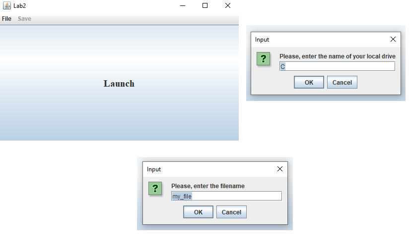
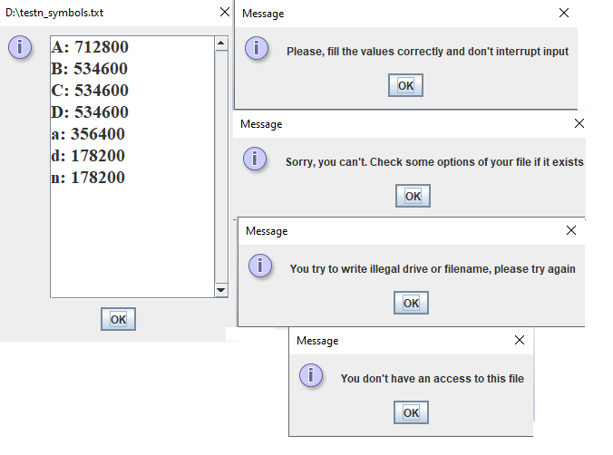

# Implementation of a class that implements counting the number of English letters case-insensitive from a file  with GUI JAVA SWING.
All methods and fields are documented according to the Javadoc standard.

## Table of contents

0. [Main Features](#Main-features)
1. [Code Examples FileWorking Class](#Code-Examples-Complex-Class)
2. [Images](#Images)

## Main Features
____
- FileWorking class,supported operations
    - Create an object with certain values
    - Create a new file with results of counting if it is possible
____
[:arrow_up:Headline](#Headline)

## Code Examples FileWorking Class
Constructors of the class of complex numbers `FileWorking`:
```Java
public class FileWorking {

    FileWorking(String d,String f) throws InvalidPathException
    {
        filename = f;
        drive = d;
        path = Path.of(drive + ":\\" + filename + ".txt");
    }
}
```
____
Write to file method of the class `FileWorking`:
```Java
public class FileWorking {

    private void writeFile() throws IOException {
        Map<Character, Integer> sorted_map = new TreeMap<Character, Integer>(map);
        StringBuilder result = new StringBuilder();
        for (Character key: sorted_map.keySet()) 
        {result.append(key).append(": ").append(sorted_map.get(key).toString()).append('\n');
        }
        Files.writeString(Path.of(drive + ":\\" + filename + "_symbols"+ ".txt"),
                result);
    }
}
```
____
Method for counting English-letters `FileWorking`:
```Java
public class Complex {

    private void counting_reading() throws IOException {
        try (FileReader fr = new FileReader(new File(String.valueOf(path)))) {
            BufferedReader reader = new BufferedReader(fr);
            String line = reader.readLine();
            while (line != null) {
                for (int i = 0; i < line.length(); ++i) {
                    int ch = line.charAt(i);
                    if (ch >= (int) 'a' && ch <= (int) 'z' || ch >= (int) 'A' && ch <= (int) 'Z') {
                        map.merge((char) ch, 1, Integer::sum);
                    }
                }
                line = reader.readLine();
            }
        } catch (IOException ioException) {
            throw new IOException();
        }
    }
}
```
____
## Images
Here's what it looks like
----
Greeting and filling

----
Result and exceptions

----
